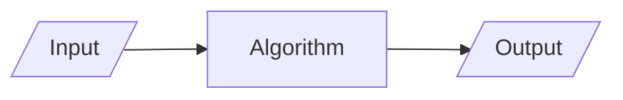

# Details

## Students

|      Roll     |        Name        |                Contributions                |
| :-----------: | :----------------: | :-----------------------------------------: |
|    2451033    |   Abhishek Biswas  |                                             |
|    2451035    |     Aman Kumar     |                                             |
|    2451040    |    Sougata Patra   |                                             |
|    2451049    |    Aditiya Raj     |                                             |

## Problem Statement

WAP in C to create the following data structure: Dancing Links

# Acknowledgement

Firstly, we would like to thank our family and friends, for their constant support throughout out university life.

Moreover, we would like to express our sincere gratitude to the Department of Computer Science, for allowing us to apply our expertise in this assignment, and also for helping us develop the required knowledge to program using the C programming language for this project.

# Introduction

## Algorithm

It is a step-by-step procedure to solve a problem in finite time.

## Complexity

Run-time complexity refers to the amount of time it takes to run an algorithm. The goal of a program is to maximize the best-case scenario and minimize the worst-case scenario.

The worst-case scenario is measured using order of complexity. The most common notation for representing this order of complexity is Big-Oh notation $O$.

Some common orders of complexity are
$$
O(1) < O(\log n) < O(n) < O(n \log n) < O(n^2 \log n) < O(n^2) < \dots < O(2^n), O(e^n)
$$

## Data Structure

It is a way of organizing and storing data in a computer so that it can be accessed and used efficiently. 

### Array

Array is a linear data structure where all elements are arranged sequentially.

### Linked List

A linked list is a linear data structure used for storing a sequence of elements, where each element is stored in a node that contains both the element and a pointer to the next node in the sequence.

### Sparse Matrix

A matrix is a two-dimensional data object made of m rows and n columns, therefore having total m x n values. If most of the elements of the matrix have 0 value, then it is called a sparse matrix.

#### Using Arrays

#### Using Linked List

### Circular Linked List

In Circular Singly Linked List, each node has just one pointer called the "next" pointer. The next pointer of the last node points back to the first node and this results in forming a circle. In this type of Linked list, we can only move through the list in one direction.

### Doubly Linked List

A doubly linked list is a type of linked list in which each node contains 3 parts, a data part and two addresses, one points to the previous node and one for the next node. It differs from the singly linked list as it has an extra pointer called previous that points to the previous node, allowing the traversal in both forward and backward directions.

### Circular Doubly Linked List

A circular doubly linked list is defined as a circular linked list in which each node has two links connecting it to the previous node and the next node.

## Dancing Links

Dancing Links is a technique to add or delete a node from a circular doubly linked list. It is particularly used to implement effective backtracking algorithms, such as Knuth's Algorithm X and the Exact Cover problem.

## Program

It is the implementation of algorithm in a programming language.

This project uses Java programming language for its implementation. Java is a programming language that is used globally to develop various application software.

# Project

## Repository

The code base and this documentation is available on a [Github Repository](https://github.com/AbhishekBiswas76/Semester-Project)

## Algorithms
