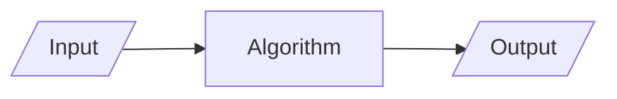

# Details

## Students

|      Roll     |        Name        |                Contributions                |
| :-----------: | :----------------: | :-----------------------------------------: |
|    2451033    |   Abhishek Biswas  |       Sparse Matrix                         |
|    2451035    |     Aman Kumar     |                                             |
|    2451040    |    Sougata Patra   |                                             |
|    2451049    |    Aditiya Raj     |                                             |

## Problem Statement

WAP in C to create the following data structure: Dancing Links

# Acknowledgement

Firstly, we would like to thank our family and friends, for their constant support throughout out university life.

Moreover, we would like to express our sincere gratitude to the Department of Computer Science, for allowing us to apply our expertise in this assignment, and also for helping us develop the required knowledge to program using the C programming language for this project.

# Introduction

## Algorithm

It is a step-by-step procedure to solve a problem in finite time.



## Complexity

Run-time complexity refers to the amount of time it takes to run an algorithm. The goal of a program is to maximize the best-case scenario and minimize the worst-case scenario.

The worst-case scenario is measured using order of complexity. The most common notation for representing this order of complexity is Big-Oh notation $O$.

Some common orders of complexity are
$$
O(1) < O(\log n) < O(n) < O(n \log n) < O(n^2 \log n) < O(n^2) < \dots < O(2^n), O(e^n)
$$

## Data Structure

It is a way of organizing and storing data in a computer so that it can be accessed and used efficiently. 

### Array

Array is a linear data structure where all elements are arranged sequentially.

### Sparse Matrix

A matrix is a two-dimensional data object made of m rows and n columns, therefore having total m x n values. If most of the elements of the matrix have 0 value, then it is called a sparse matrix.

### Linked List

A linked list is a linear data structure used for storing a sequence of elements, where each element is stored in a node that contains both the element and a pointer to the next node in the sequence.

### Circular Linked List

In Circular Singly Linked List, each node has just one pointer called the "next" pointer. The next pointer of the last node points back to the first node and this results in forming a circle. In this type of Linked list, we can only move through the list in one direction.

### Doubly Linked List

A doubly linked list is a type of linked list in which each node contains 3 parts, a data part and two addresses, one points to the previous node and one for the next node. It differs from the singly linked list as it has an extra pointer called previous that points to the previous node, allowing the traversal in both forward and backward directions.

### Circular Doubly Linked List

A circular doubly linked list is defined as a circular linked list in which each node has two links connecting it to the previous node and the next node.

## Dancing Links

Dancing Links is a technique to add or delete a node from a circular doubly linked list. It is particularly used to implement effective backtracking algorithms, such as Knuth's Algorithm X and the Exact Cover problem.

## Program

It is the implementation of algorithm in a programming language

This project uses Java programming language for its implementation. Java is a programming language that is used globally to develop various application software.

# Project

## Repository

The code base and this documentation is available on a [Github Repository]

## Algorithms

### Sparse Matrix

```c
// using Array
#include<stdio.h>

int main()
{
    // Assume 4x5 sparse matrix
    int sparseMatrix[4][5] =
    {
        {0 , 0 , 3 , 0 , 4 },
        {0 , 0 , 5 , 7 , 0 },
        {0 , 0 , 0 , 0 , 0 },
        {0 , 2 , 6 , 0 , 0 }
    };

    int size = 0;
    for (int i = 0; i < 4; i++)
        for (int j = 0; j < 5; j++)
            if (sparseMatrix[i][j] != 0)
                size++;

    // number of columns in compactMatrix (size) must be
    // equal to number of non - zero elements in
    // sparseMatrix
    int compactMatrix[3][size];

    // Making of new matrix
    int k = 0;
    for (int i = 0; i < 4; i++)
        for (int j = 0; j < 5; j++)
            if (sparseMatrix[i][j] != 0)
            {
                compactMatrix[0][k] = i;
                compactMatrix[1][k] = j;
                compactMatrix[2][k] = sparseMatrix[i][j];
                k++;
            }

    for (int i=0; i<3; i++)
    {
        for (int j=0; j<size; j++)
            printf("%d ", compactMatrix[i][j]);

        printf("\n");
    }
    return 0;
}
```
## Source Code

```c
#include <stdio.h>
#include <stdlib.h>
#include <string.h>

// Node structure for the Dancing Links matrix
typedef struct Node {
    struct Node *left, *right, *up, *down; // Links for the doubly-linked list
    struct Node *column; // Pointer to column header
    int row_id; // Row identifier
    int col_id; // Column identifier
    int node_count; // Number of nodes in column (for column header)
} Node;

// Structure to hold the DLX solver state
typedef struct {
    Node *root; // Root of the circular doubly-linked list
    Node **columns; // Array of column headers
    int num_cols; // Number of columns
    int *solution; // Array to store the solution (row IDs)
    int solution_size; // Current size of the solution
    int max_solution_size; // Maximum size of the solution array
    int num_rows; // Current number of rows added
} DLX;

// Initialize a new node
Node* create_node(int row_id, int col_id) {
    Node *node = (Node*)malloc(sizeof(Node));
    node->left = node->right = node->up = node->down = node;
    node->column = NULL;
    node->row_id = row_id;
    node->col_id = col_id;
    node->node_count = 0;
    return node;
}

// Initialize the DLX solver
DLX* init_dlx(int num_cols, int max_rows) {
    DLX *dlx = (DLX*)malloc(sizeof(DLX));
    dlx->num_cols = num_cols;
    dlx->root = create_node(-1, -1); // Root node
    dlx->columns = (Node**)malloc(num_cols * sizeof(Node*));
    dlx->solution = (int*)malloc(max_rows * sizeof(int));
    dlx->solution_size = 0;
    dlx->max_solution_size = max_rows;
    dlx->num_rows = 0;

    // Initialize column headers
    for (int i = 0; i < num_cols; i++) {
        dlx->columns[i] = create_node(-1, i);
        dlx->columns[i]->node_count = 0;
        dlx->columns[i]->column = dlx->columns[i];
        // Link column headers to root
        dlx->columns[i]->right = dlx->root;
        dlx->columns[i]->left = dlx->root->left;
        dlx->root->left->right = dlx->columns[i];
        dlx->root->left = dlx->columns[i];
    }
    return dlx;
}

// Add a row to the DLX matrix (sparse matrix representation)
void add_row(DLX *dlx, int row_id, int *cols, int num_ones) {
    Node *first_node = NULL;
    for (int i = 0; i < num_ones; i++) {
        int col_id = cols[i];
        if (col_id < 0 || col_id >= dlx->num_cols) continue; // Validate column index
        Node *node = create_node(row_id, col_id);
        node->column = dlx->columns[col_id];

        // Link vertically
        node->down = dlx->columns[col_id];
        node->up = dlx->columns[col_id]->up;
        dlx->columns[col_id]->up->down = node;
        dlx->columns[col_id]->up = node;
        dlx->columns[col_id]->node_count++;

        // Link horizontally
        if (first_node == NULL) {
            first_node = node;
        } else {
            node->right = first_node;
            node->left = first_node->left;
            first_node->left->right = node;
            first_node->left = node;
        }
    }
    dlx->num_rows++;
}

// Cover a column (remove it from the matrix)
void cover_column(Node *col) {
    // Remove column header from header list
    col->right->left = col->left;
    col->left->right = col->right;

    // Remove all rows in this column
    for (Node *row = col->down; row != col; row = row->down) {
        for (Node *node = row->right; node != row; node = node->right) {
            node->up->down = node->down;
            node->down->up = node->up;
            node->column->node_count--;
        }
    }
}

// Uncover a column (restore it to the matrix)
void uncover_column(Node *col) {
    // Restore all rows in this column
    for (Node *row = col->up; row != col; row = row->up) {
        for (Node *node = row->left; node != row; node = node->left) {
            node->up->down = node;
            node->down->up = node;
            node->column->node_count++;
        }
    }
    // Restore column header
    col->right->left = col;
    col->left->right = col;
}

// Choose the column with the fewest nodes (heuristic for efficiency)
Node* choose_column(DLX *dlx) {
    Node *min_col = NULL;
    int min_count = __INT_MAX__;

    for (Node *col = dlx->root->right; col != dlx->root; col = col->right) {
        if (col->node_count < min_count) {
            min_count = col->node_count;
            min_col = col;
        }
    }
    return min_col;
}

// Recursive search for exact cover solution
int search(DLX *dlx, int (*callback)(DLX*, void*), void *context) {
    if (dlx->root->right == dlx->root) {
        // Solution found, invoke callback
        if (callback) {
            return callback(dlx, context);
        }
        return 1; // Solution found
    }

    Node *col = choose_column(dlx);
    if (col == NULL || col->node_count == 0) return 0; // No solution possible

    cover_column(col);

    for (Node *row = col->down; row != col; row = row->down) {
        dlx->solution[dlx->solution_size++] = row->row_id;

        // Cover all columns in this row
        for (Node *node = row->right; node != row; node = node->right) {
            cover_column(node->column);
        }

        // Recurse
        if (search(dlx, callback, context)) return 1;

        // Backtrack: uncover columns in reverse order
        for (Node *node = row->left; node != row; node = node->left) {
            uncover_column(node->column);
        }

        dlx->solution_size--;
    }

    uncover_column(col);
    return 0; // No solution found
}

// Callback function to print solution (example)
int print_solution(DLX *dlx, void *context) {
    printf("Solution found: ");
    for (int i = 0; i < dlx->solution_size; i++) {
        printf("%d ", dlx->solution[i]);
    }
    printf("\n");
    return 1; // Continue searching for more solutions if desired (but here we stop at first)
}

// Free the DLX structure and all nodes
void free_dlx(DLX *dlx) {
    // Free all nodes in each column
    for (int i = 0; i < dlx->num_cols; i++) {
        Node *col = dlx->columns[i];
        Node *node = col->down;
        while (node != col) {
            Node *next = node->down;
            free(node);
            node = next;
        }
        free(col);
    }
    free(dlx->columns);
    free(dlx->solution);
    free(dlx->root);
    free(dlx);
}

// Function to print the current matrix (for debugging)
void print_matrix(DLX *dlx) {
    printf("Current DLX Matrix (sparse representation):\n");
    for (int i = 0; i < dlx->num_cols; i++) {
        printf("Column %d (count: %d): ", i, dlx->columns[i]->node_count);
        for (Node *node = dlx->columns[i]->down; node != dlx->columns[i]; node = node->down) {
            printf("Row %d ", node->row_id);
        }
        printf("\n");
    }
}

// Interactive function to add a row
void interactive_add_row(DLX *dlx) {
    int row_id = dlx->num_rows; // Auto-increment row ID
    printf("Enter the number of 1's in this row: ");
    int num_ones;
    scanf("%d", &num_ones);
    if (num_ones <= 0 || num_ones > dlx->num_cols) {
        printf("Invalid number of 1's.\n");
        return;
    }
    int *cols = (int*)malloc(num_ones * sizeof(int));
    printf("Enter the column indices (0 to %d) where 1's are: ", dlx->num_cols - 1);
    for (int i = 0; i < num_ones; i++) {
        scanf("%d", &cols[i]);
    }
    add_row(dlx, row_id, cols, num_ones);
    free(cols);
    printf("Row %d added.\n", row_id);
}

// Main function with switch-case menu
int main() {
    DLX *dlx = NULL;
    int choice;
    int num_cols = 0;
    int max_rows = 100; // Default max rows for solution array

    do {
        printf("\nDancing Links Menu:\n");
        printf("1. Initialize DLX (set number of columns)\n");
        printf("2. Add Row\n");
        printf("3. Print Matrix\n");
        printf("4. Solve Exact Cover\n");
        printf("5. Exit\n");
        printf("Enter your choice: ");
        scanf("%d", &choice);

        switch (choice) {
            case 1:
                if (dlx != NULL) {
                    free_dlx(dlx);
                    dlx = NULL;
                }
                printf("Enter number of columns: ");
                scanf("%d", &num_cols);
                if (num_cols <= 0) {
                    printf("Invalid number of columns.\n");
                    break;
                }
                printf("Enter maximum expected rows (for solution buffer): ");
                scanf("%d", &max_rows);
                dlx = init_dlx(num_cols, max_rows);
                printf("DLX initialized with %d columns.\n", num_cols);
                break;

            case 2:
                if (dlx == NULL) {
                    printf("Please initialize DLX first.\n");
                    break;
                }
                interactive_add_row(dlx);
                break;

            case 3:
                if (dlx == NULL) {
                    printf("Please initialize DLX first.\n");
                    break;
                }
                print_matrix(dlx);
                break;

            case 4:
                if (dlx == NULL) {
                    printf("Please initialize DLX first.\n");
                    break;
                }
                if (dlx->num_rows == 0) {
                    printf("No rows added yet.\n");
                    break;
                }
                printf("Solving...\n");
                if (!search(dlx, print_solution, NULL)) {
                    printf("No solution exists.\n");
                }
                break;

            case 5:
                printf("Exiting...\n");
                if (dlx != NULL) {
                    free_dlx(dlx);
                }
                break;

            default:
                printf("Invalid choice. Please try again.\n");
        }
    } while (choice != 5);

    return 0;
}
```
## Input

## Output

# References


