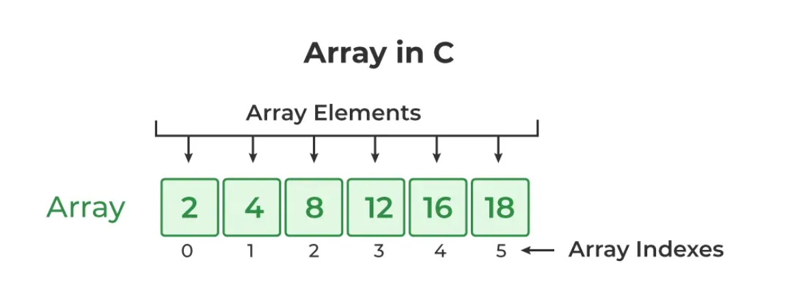

# Details

## Students

|      Roll     |        Name        |                 
| :-----------: | :----------------: | 
|    2451033    |   Abhishek Biswas  |                                             
|    2451035    |     Aman Kumar     |                                             
|    2451040    |    Sougata Patra   |                                             
|    2451049    |    Aditiya Raj     |                                             

## Problem Statement

WAP in C to create the following data structure: Dancing Links

# Acknowledgement

Firstly, we would like to thank our family and friends, for their constant support throughout out university life.

Moreover, we would like to express our sincere gratitude to the Department of Computer Science, for allowing us to apply our expertise in this assignment, and also for helping us develop the required knowledge to program using the C programming language for this project.

# Introduction

## Algorithm

It is a step-by-step procedure to solve a problem in finite time.


## Complexity

Run-time complexity refers to the amount of time it takes to run an algorithm. The goal of a program is to maximize the best-case scenario and minimize the worst-case scenario.

The worst-case scenario is measured using order of complexity. The most common notation for representing this order of complexity is Big-Oh notation O(g(n)).

Some common orders of complexity are:-

$$O(1) < O(log n) < O(n) < O(n*log n) < O(n^2) < O(n^3) < O(2^n) < O(n!)$$


## Data Structure

It is a way of organizing and storing data in a computer so that it can be accessed and used efficiently. 

### Array

Array is a linear data structure where all elements are arranged sequentially.



### Linked List

A linked list is a linear data structure used for storing a sequence of elements, where each element is stored in a node that contains both the element and a pointer to the next node in the sequence.


### Sparse Matrix

A matrix is a two-dimensional data object made of m rows and n columns, therefore having total m x n values. If most of the elements of the matrix have 0 value, then it is called a sparse matrix.

#### Using Arrays


#### Using Linked List


### Tree

It is a non-linear hierarchical data structure, where there is a single root node and every other node contains a parent and/or child. Linear data structures like arrays, stacks, queues, and linked list can be traversed in only one way. But a hierarchical data structure like a tree can be traversed in different ways.


### Circular Linked List

In Circular Singly Linked List, each node has just one pointer called the "next" pointer. The next pointer of the last node points back to the first node and this results in forming a circle. In this type of Linked list, we can only move through the list in one direction.


### Doubly Linked List

A doubly linked list is a type of linked list in which each node contains 3 parts, a data part and two addresses, one points to the previous node and one for the next node. It differs from the singly linked list as it has an extra pointer called previous that points to the previous node, allowing the traversal in both forward and backward directions.


### Circular Doubly Linked List

A circular doubly linked list is defined as a circular linked list in which each node has two links connecting it to the previous node and the next node.


## Dancing Links

Dancing Links is a technique for implementing backtracking algorithms, like Algorithm X, that efficiently solve problems such as Sudoku or Exact Cover by using sparse matrix represented with circular doubly linked lists. 


## Program

It is the implementation of algorithm in a programming language.

This project uses C programming language for its implementation. C is a programming language that is used globally to develop various application software.

# Project

## Repository

The code base and this documentation is available on a [Github Repository](https://github.com/AbhishekBiswas76/Semester-Project)

## Algorithms

| Algorithm                                      | Complexity    |
| ---------------------------------------------- | ------------- |
| `initialize_dlx(DLX *dlx, int rows, int cols)` | $O(n)$
| `insert_node(DLX *dlx, int row, int col)`      | $O(n)$
| `cover_column(Node *col)`                      | $O(n)$
| `uncover_column(Node *col)`                    | $O(n)$
| `search(DLX *dlx, int k)`                      | $O(1)$
| `print_matrix(DLX *dlx)`                       | $O(1)$
| `print_solutions(DLX *dlx)`                    | $O(1)$
| `input_matrix(DLX *dlx)`                       | $O(n)$

## Source Code 

```c
#include <stdio.h>
#include <stdlib.h>
#include <stdbool.h>

// Maximum size for the matrix (adjust as needed)
#define MAX_ROWS 100
#define MAX_COLS 100
#define MAX_NODES 10000

// Node structure for the Dancing Links matrix
typedef struct Node {
    struct Node *left, *right, *up, *down, *column;
    int row_id, col_id, node_count;
} Node;

// Structure to hold the Dancing Links matrix and solutions
typedef struct {
    Node *root;
    Node *headers[MAX_COLS];
    Node nodes[MAX_NODES];
    int node_count;
    int rows, cols;
    int solutions[MAX_ROWS][MAX_COLS];
    int solution_count;
} DLX;

// Function prototypes
void initialize_dlx(DLX *dlx, int rows, int cols);
void insert_node(DLX *dlx, int row, int col);
void cover_column(Node *col);
void uncover_column(Node *col);
void search(DLX *dlx, int k);
void print_matrix(DLX *dlx);
void print_solutions(DLX *dlx);
void input_matrix(DLX *dlx);

// Initialize the Dancing Links matrix
void initialize_dlx(DLX *dlx, int rows, int cols) {
    dlx->rows = rows;
    dlx->cols = cols;
    dlx->node_count = 0;
    dlx->solution_count = 0;
    dlx->root = &dlx->nodes[dlx->node_count++];
    dlx->root->left = dlx->root->right = dlx->root;
    dlx->root->up = dlx->root->down = dlx->root;

    // Initialize column headers
    for (int i = 0; i < cols; i++) {
        dlx->headers[i] = &dlx->nodes[dlx->node_count++];
        dlx->headers[i]->node_count = 0;
        dlx->headers[i]->col_id = i;
        dlx->headers[i->left = dlx->root->left;
        dlx->headers[i]->right = dlx->root;
        dlx->root->left->right = dlx->headers[i];
        dlx->root->left = dlx->headers[i];
        dlx->headers[i]->up = dlx->headers[i];
        dlx->headers[i]->down = dlx->headers[i];
    }
}

// Insert a node at (row, col) in the matrix
void insert_node(DLX *dlx, int row, int col) {
    Node *node = &dlx->nodes[dlx->node_count++];
    node->row_id = row;
    node->col_id = col;
    node->column = dlx->headers[col];

    // Link vertically
    node->down = dlx->headers[col];
    node->up = dlx->headers[col]->up;
    dlx->headers[col]->up->down = node;
    dlx->headers[col]->up = node;

    // Link horizontally
    Node *row_start = node;
    if (dlx->node_count > 1 && dlx->nodes[dlx->node_count-2].row_id == row) {
        row_start = &dlx->nodes[dlx->node_count-2];
        node->left = row_start;
        node->right = row_start->right;
        row_start->right->left = node;
        row_start->right = node;
    } else {
        node->left = node;
        node->right = node;
    }

    dlx->headers[col]->node_count++;
}

// Cover a column (remove it from consideration)
void cover_column(Node *col) {
    col->right->left = col->left;
    col->left->right = col->right;
    for (Node *i = col->down; i != col; i = i->down) {
        for (Node *j = i->right; j != i; j = j->right) {
            j->down->up = j->up;
            j->up->down = j->down;
            j->column->node_count--;
        }
    }
}

// Uncover a column (restore it)
void uncover_column(Node *col) {
    for (Node *i = col->up; i != col; i = i->up) {
        for (Node *j = i->left; j != i; j = j->left) {
            j->column->node_count++;
            j->down->up = j;
            j->up->down = j;
        }
    }
    col->right->left = col;
    col->left->right = col;
}

// Search for solutions using Algorithm X
void search(DLX *dlx, int k) {
    if (dlx->root->right == dlx->root) {
        dlx->solution_count++;
        return;
    }

    Node *col = dlx->root->right;
    cover_column(col);

    for (Node *r = col->down; r != col; r = r->down) {
        dlx->solutions[dlx->solution_count][k] = r->row_id;
        for (Node *j = r->right; j != r; j = j->right) {
            cover_column(j->column);
        }
        search(dlx, k + 1);
        for (Node *j = r->left; j != r; j = j->left) {
            uncover_column(j->column);
        }
    }
    uncover_column(col);
}

// Print the current matrix
void print_matrix(DLX *dlx) {
    printf("\nCurrent Matrix (%d rows x %d cols):\n", dlx->rows, dlx->cols);
    int matrix[MAX_ROWS][MAX_COLS] = {0};
    for (int i = 0; i < dlx->node_count; i++) {
        if (dlx->nodes[i].row_id >= 0) {
            matrix[dlx->nodes[i].row_id][dlx->nodes[i].col_id] = 1;
        }
    }
    for (int i = 0; i < dlx->rows; i++) {
        for (int j = 0; j < dlx->cols; j++) {
            printf("%d ", matrix[i][j]);
        }
        printf("\n");
    }
}

// Print all found solutions
void print_solutions(DLX *dlx) {
    printf("\nFound %d solution(s):\n", dlx->solution_count);
    for (int i = 0; i < dlx->solution_count; i++) {
        printf("Solution %d: Rows selected = ", i + 1);
        for (int j = 0; j < dlx->rows && dlx->solutions[i][j] != 0; j++) {
            printf("%d ", dlx->solutions[i][j]);
        }
        printf("\n");
    }
}

// Input matrix from user
void input_matrix(DLX *dlx) {
    int rows, cols;
    printf("Enter number of rows (max %d): ", MAX_ROWS);
    scanf("%d", &rows);
    printf("Enter number of columns (max %d): ", MAX_COLS);
    scanf("%d", &cols);
    if (rows <= 0 || cols <= 0 || rows > MAX_ROWS || cols > MAX_COLS) {
        printf("Invalid dimensions!\n");
        return;
    }

    initialize_dlx(dlx, rows, cols);
    printf("Enter the matrix (%d x %d, 0s and 1s only):\n", rows, cols);
    for (int i = 0; i < rows; i++) {
        for (int j = 0; j < cols; j++) {
            int value;
            scanf("%d", &value);
            if (value == 1) {
                insert_node(dlx, i, j);
            }
        }
    }
    printf("Matrix input complete.\n");
}

int main() {
    DLX dlx;
    int choice;

    printf("Dancing Links Algorithm for Exact Cover Problem\n");
    while (true) {
        printf("\nMenu:\n");
        printf("1. Input a new matrix\n");
        printf("2. Solve the Exact Cover problem\n");
        printf("3. Display current matrix\n");
        printf("4. Display all solutions\n");
        printf("5. Exit\n");
        printf("Enter your choice (1-5): ");
        scanf("%d", &choice);

        switch (choice) {
            case 1:
                input_matrix(&dlx);
                break;
            case 2:
                dlx.solution_count = 0;
                search(&dlx, 0);
                printf("Solving complete. Found %d solution(s).\n", dlx.solution_count);
                break;
            case 3:
                print_matrix(&dlx);
                break;
            case 4:
                print_solutions(&dlx);
                break;
            case 5:
                printf("Exiting program.\n");
                return 0;
            default:
                printf("Invalid choice! Please enter 1-5.\n");
        }
    }
    return 0;
}
```

## Output

### Simple Exact Cover Problem

```
Dancing Links Algorithm for Exact Cover Problem

Menu:
1. Input a new matrix
2. Solve the Exact Cover problem
3. Display current matrix
4. Display all solutions
5. Exit
Enter your choice (1-5): 1
Enter number of rows (max 100): 3
Enter number of columns (max 100): 4
Enter the matrix (3 x 4, 0s and 1s only):
1 0 1 0
0 1 1 1
1 1 0 0
Matrix input complete.

Menu:
Enter your choice (1-5): 3
Current Matrix (3 x 4):
1 0 1 0
0 1 1 1
1 1 0 0

Menu:
Enter your choice (1-5): 2
Solving complete. Found 1 solution(s).

Menu:
Enter your choice (1-5): 4
Found 1 solution(s):
Solution 1: Rows selected = 0 2

Menu:
Enter your choice (1-5): 5
Exiting program.
```

### No Solution

```
Dancing Links Algorithm for Exact Cover Problem

Menu:
Enter your choice (1-5): 1
Enter number of rows (max 100): 2
Enter number of columns (max 100): 3
Enter the matrix (2 x 3, 0s and 1s only):
1 0 0
0 1 0
Matrix input complete.

Menu:
Enter your choice (1-5): 2
Solving complete. Found 0 solution(s).

Menu:
Enter your choice (1-5): 4
Found 0 solution(s):

Menu:
Enter your choice (1-5): 5
Exiting program.
```

### Multiple Solutions

```
Dancing Links Algorithm for Exact Cover Problem

Menu:
Enter your choice (1-5): 1
Enter number of rows (max 100): 3
Enter number of columns (max 100): 3
Enter the matrix (3 x 3, 0s and 1s only):
1 0 1
0 1 1
1 1 0
Matrix input complete.

Menu:
Enter your choice (1-5): 2
Solving complete. Found 2 solution(s).

Menu:
Enter your choice (1-5): 4
Found 2 solution(s):
Solution 1: Rows selected = 0
Solution 2: Rows selected = 1 2

Menu:
Enter your choice (1-5): 5
Exiting program.
```

### Invalid Input

```
Dancing Links Algorithm for Exact Cover Problem

Menu:
Enter your choice (1-5): 1
Enter number of rows (max 100): 101
Enter number of columns (max 100): 4
Invalid dimensions!

Menu:
Enter your choice (1-5): 5
Exiting program.
```

## Application Puzzles

### Sudoku


#### Source Code

### N-Queens


#### Recursive Tree Approach


#### Source Code

## Conclusion

Using C, we were able to connect and apply the knowledge that we have learned in Data Structures and Algorithms. We understood the importance of such concepts which are then used to solve real life problems.


